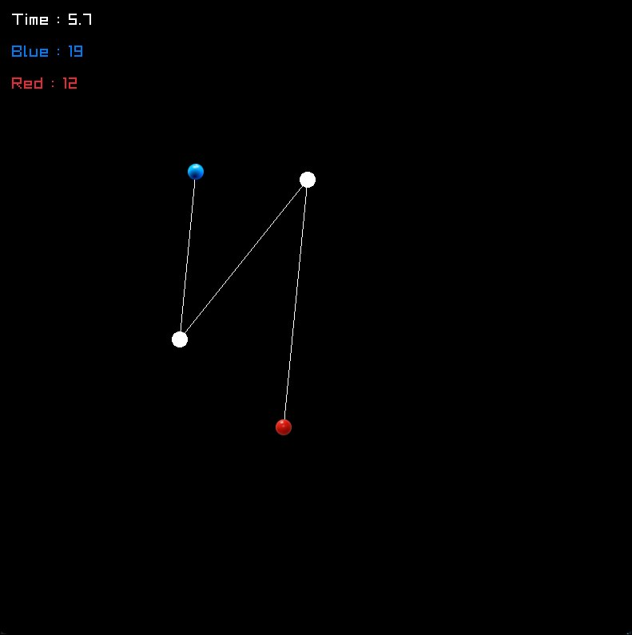

# Drop It 🎮

**Drop It** is a simple **2-player local game** written in **C** using the **raylib** library.  

---

## 🕹️ Gameplay Overview

- Two players (**Red** and **Blue**) control circles on the screen
- Players can move and plant bombs 
- The game runs on a **20-second timer** (changeable)
- Points are awarded when a enemy hits the bombs

---

## 🎹 Controls

### 🔴 Red Player
| Key | Action |
|---|---|
| W / A / S / D | Move |
| Space | Shoot |

### 🔵 Blue Player
| Key | Action |
|---|---|
| Arrow Keys | Move |
| Right Shift | Shoot |

### General
| Key | Action |
|---|---|
| ENTER | Start / Restart game |
| ESC | Exit |

---

## 🖼️ Screenshot




---

## 🛠️ Built With

- **C Language**
- **raylib** (graphics, input, textures, timing)

---

## ▶️ How to Build and Run

### Requirements
- Linux (tested on Arch Linux)
- C compiler (gcc or clang)
- raylib installed

### Compile
```bash
gcc Dropit.c -o Dropit -lraylib -lm -ldl -lpthread -lX11 && ./Dropit
